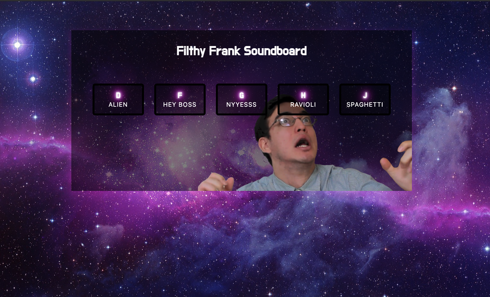
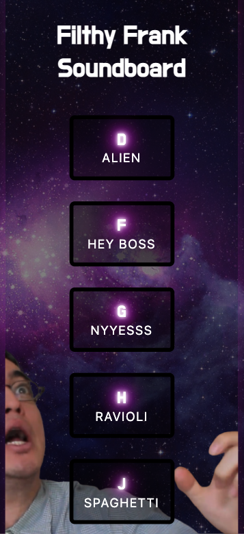

# Filthy Frank Soundboard

This soundboard was inspired by the drumkit keyboard project from Wes Bos's JavaScript 30 course. In addition to recreating the keyboard functionality of the project, I added in click functions to each sound div so that this app would work on mobile devices as well. This was a fun project, but it made me realize I have too much power as a developer to make endless meme content. 

You can test out the soundboard [here](https://sarahdepalo.github.io/filthyFrank/).

## Screenshots

